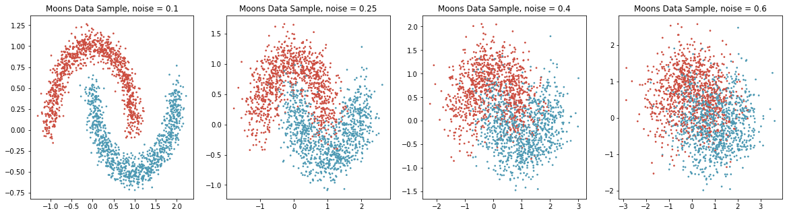
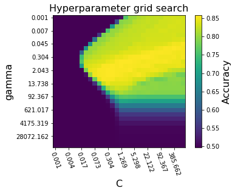
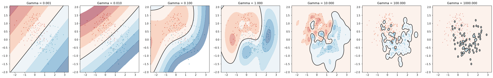

# svm-examples
 For this assignment, support vector classifiers were used to classify data from a non-linearly separable toy dataset (the moons dataset from scikit-learn). Some example datasets created using this utility can be seen below.

 
 Grid search was used to tune the hyperparameters C and γ for a support vector classifier. The hyperparameter C is a coefficient that weights the importance of maximizing the margin between examples of different classes in the overall optimization problem of fitting the support vector machine. In effect, C can be used to tune the overfitting or underfitting of the model by balancing the tradoff between reducing the number of misclassifications with that of having a large margin of separation between classes.
The hyperparameter  γ  controls how far the influence of a single training example reaches. A larger value results in a more complex model.

Fit support vector classifiers were plotted in 2D and 3D to illustrate the decision boundary.

 With a fixed value of gamma, C was adjusted to illustrate how this hyperparameter affects the complexity and overfittedness of the decision function. 

 The same was done for gamma with a fixed C. 

